# IM即时聊天

### 介绍
Raingad-IM是一个开源的即时通信demo，需要前后端配合使用，主要用于学习交流，为大家提供即时通讯的开发思路，许多功能需要自行开发，开发的初衷旨在快速建立企业内部通讯系统、内网交流、社区交流。

|  类型 | 链接 |备注|
| --------- | ---- |---- |
| 技术分享站上线（官网）    | https://www.shooyu.cn | 书瑜网 |
| 前端源码（含后台管理）    | https://gitee.com/raingad/im-chat-front | 只维护后台管理 |
| 后端源码（已编译前端） | https://gitee.com/raingad/im-instant-chat |  |
| web端演示 | http://im.raingad.com/index.html |  |
| 移动端H5演示 | http://im.raingad.com/h5 |  |
| 桌面端/安卓端 | 请进前端演示页下载 |  持续更新 |

体验账号：13800000002  密码：123456

尾号2、3、4......18、19、20 都是

体验账号：13800000020  密码：123456 

### 支持功能

- 支持单聊和群聊，支持发送表情、图片、语音、视频和文件消息
- 单聊支持消息已读未读的状态显示，在线状态显示
- 群聊创建、删除和群成员管理、群公告、群禁言、@群成员等
- 支持置顶联系人，消息免打扰；
- 支持设置新消息声音提醒，浏览器通知
- 支持管理员撤回群成员消息，支持群成员不能互相添加好友
- 支持一对一音视频通话（已打通web端和移动端，小程序不支持）
- 支持文件、图片和绝大部分媒体文件在线预览
- 支持移动端（由uniapp开发，可打包H5、APP和小程序）
- 全新支持企业模式和社区模式，社区模式支持注册、添加好友功能
- APP支持通知栏消息推送（需要开启unipush模块，并开启手机通知权限，仅支持APP在线推送）
- 支持简易后台管理，包括用户管理、群组管理、系统设置等

### 最新更新
请查看右侧发行版更新日志

**v6.0.0** (2025年5月20日) 

1. 新增移动端和桌面端国际化，可以自由新增语言。
2. 新增群头像、消息已读、消息转发等消息队列处理；采用默认头像，取消后台生成文字头像，提升性能。
3. 新增定时清理消息可以删除文件，避免文件占用太大空间。
4. 移动端调整大量的UI界面和配色，更换了导航栏图标。
5. 移动端更换了新的保活插件，支持IOS，支持APP提示直接去系统设置消息通知权限和调整省电策略。
6. 移动端会话列表支持下拉刷新消息，支持双击导航栏消息图标，快速定位未读会话和@我的会话。
7. 移动端聊天记录列表采用虚拟列表，再多的数据也不对卡顿，采用z-paging，可以丝滑加载更多聊天记录。
8. 移动端聊天记录滚动时，可以看到新消息数量。
9. web端后台管理新增建议用户数据统计，可以查看在线用户数和设备数。
10. 桌面端新增音视频通话窗口移动，支持最小化到右下角，让聊天无遮挡，通话体验更佳！
11. 优化Lemon-IMUI组件的国际化，以及更新chatarea组件为最新版本。
12. 修复若干BUG！

### 软件架构

后端技术栈：`thinkphp6+workerman+redis`

前端技术栈：`vue2+Lemon-IMUI+element-UI`

桌面端：`vue2+Lemon-IMUI+element-UI + electron` [联系作者，捐赠获取]

移动端：`uniapp for vue3 + pinia`[联系作者，捐赠获取]

### 安装教程
1.  克隆代码到本地： 
``` 
git clone https://gitee.com/raingad/im-chat-front.git
```
2.  进入项目目录，执行： 
```
npm install
```
3.  开发调试
```
npm run serve
```

4.  修改服务端域名

修改项目根目录下的 `.env.development` 文件，将VUE_APP_BASE_API的值改为自己的后端域名，构建后放服务端在运行时直接获取服务端的域名。


5.  构建
```
npm run build
```

6. 将打包好的文件(dist目录)里面的所有文件覆盖到后端的public目录下即可。

### 安装部署服务

服务器要求：
|  所需环境 | 版本 | 备注 | 推荐版本 |
| --------- | ---- | ---- | ---|
| linux    | >= 7.0 |  以下的版本未做测试   | 7.9 |
| nginx    | >= 1.17 |     | 最新的 |
| php | >= 7.1 |  不兼容8和7.4    | 7.3 |
| mysql    | >= 5.7 | 必须要5.7及以上     | 5.7 |
| redis    | >= 5.0 |     | 7.0 |

前端项目运行要求：

|  所需环境 | 版本 | 备注 |
| --------- | ---- | ---- |
| node    | >= 14.0.0 |  14以下的版本未做测试   |
| npm | >= 7.0.0 |      |


作者提供本系统的安装服务，包括后端和前端部署到线上，可手把手教学，保证项目的完美运行，200元/次，安装服务可赠送详细的安装教程以及接口文档，如有需要可以进群联系作者！

### 交流群

请先认真查看本页文档，如果有什么问题，可以留言，有购买移动端需求可以加入我们的QQ群。

【仅限有问题或者购买移动端需求才可以申请加入交流群（长时间不活跃的将被定期清理），加群前请先点Star，否则不予通过】
 
[QQ 交流群：1031495465](https://qm.qq.com/q/RgHdvLGiMk)

### 部分截图
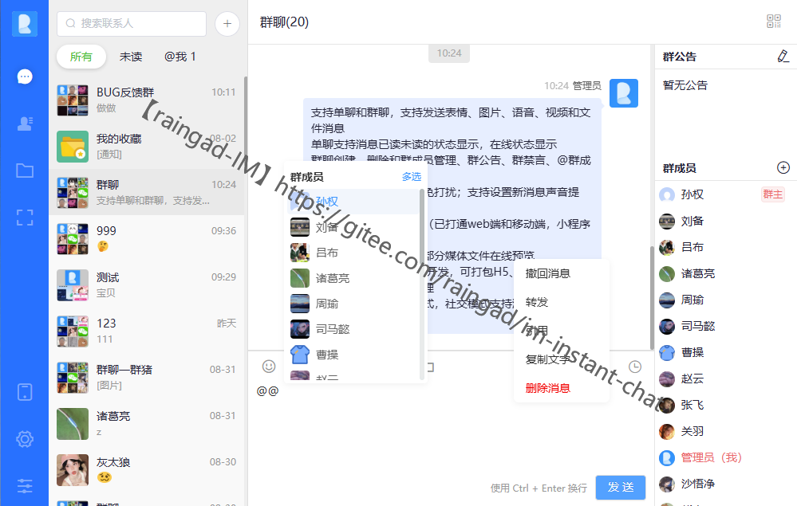

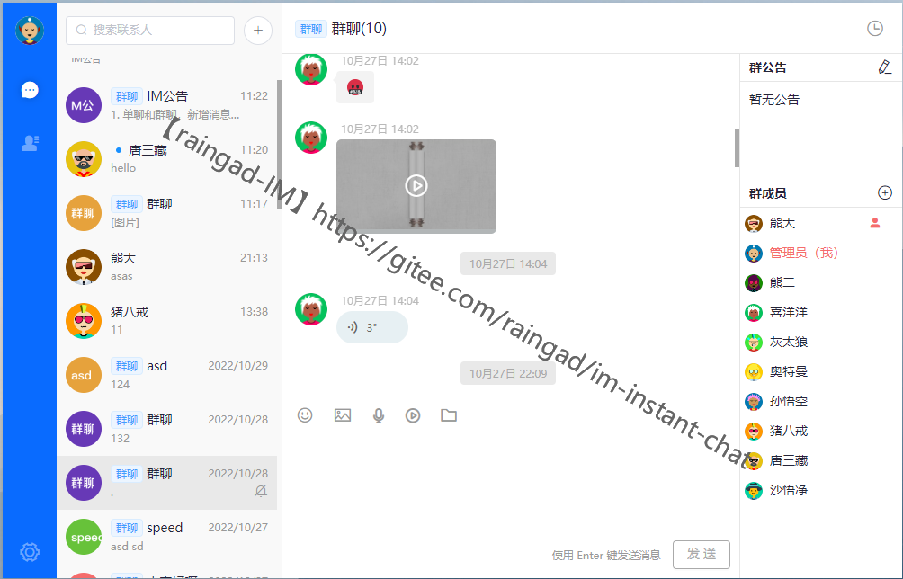

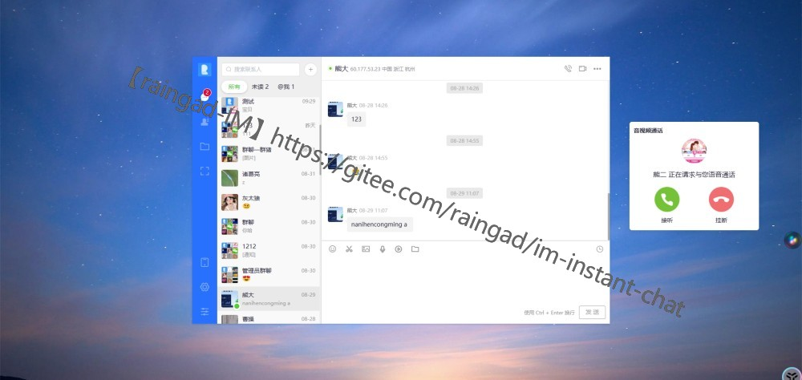

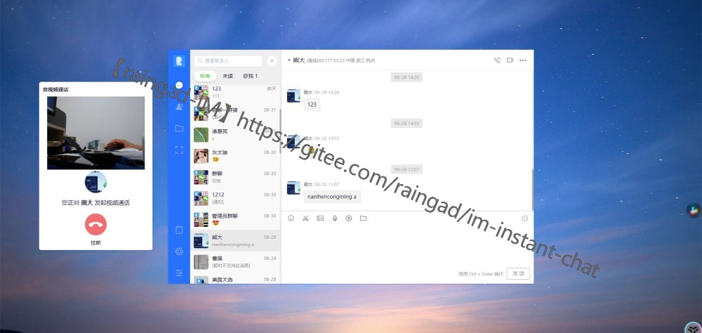

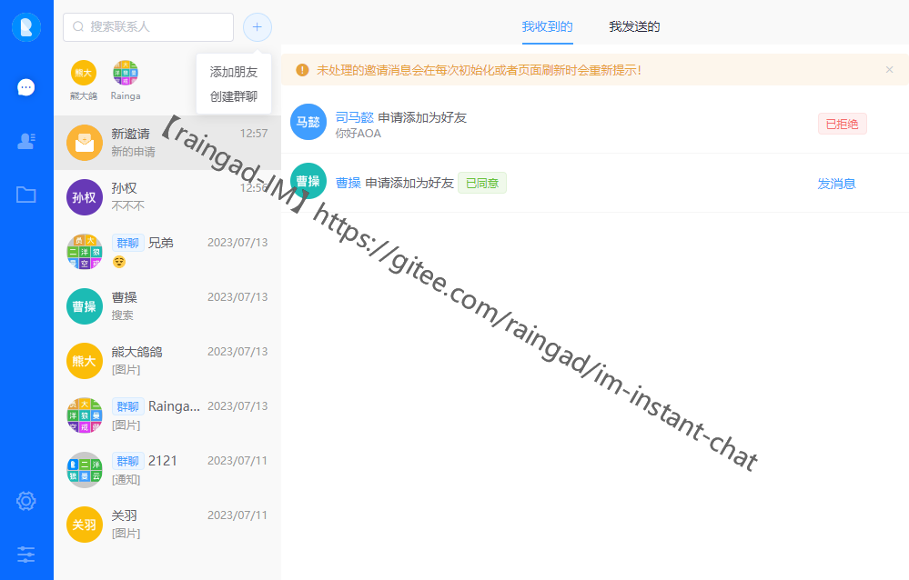

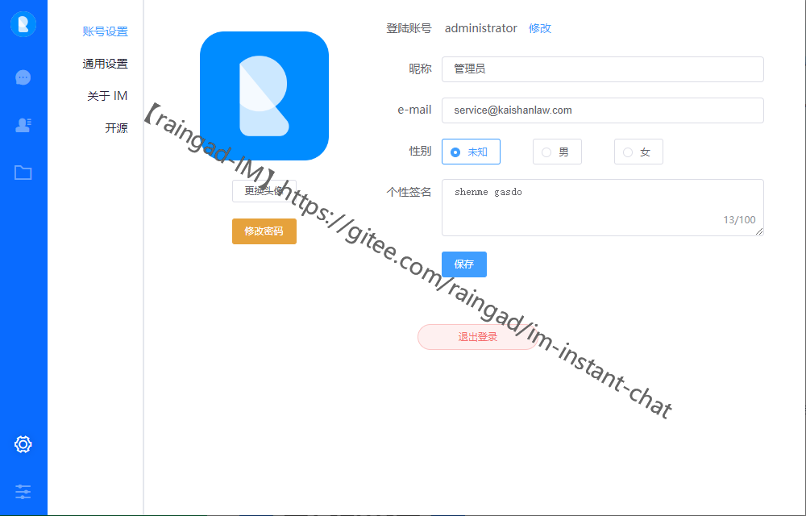

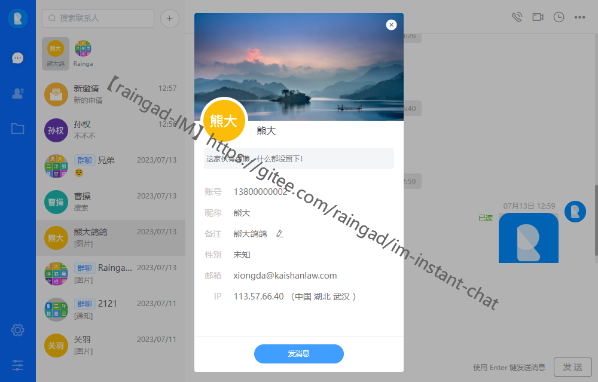

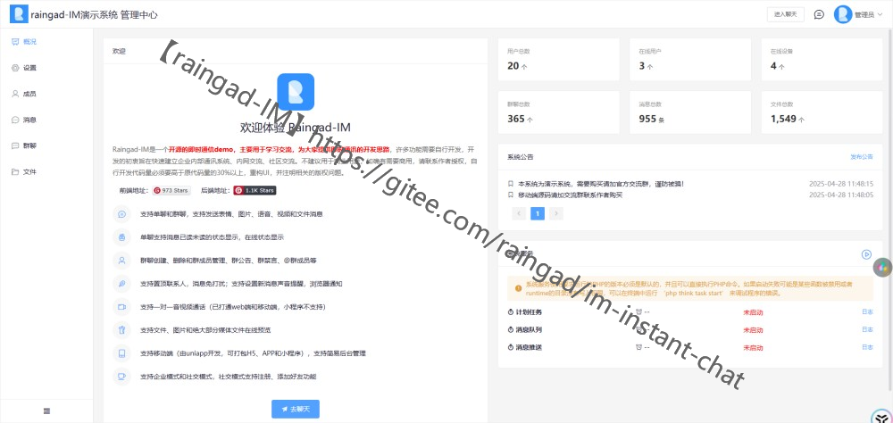

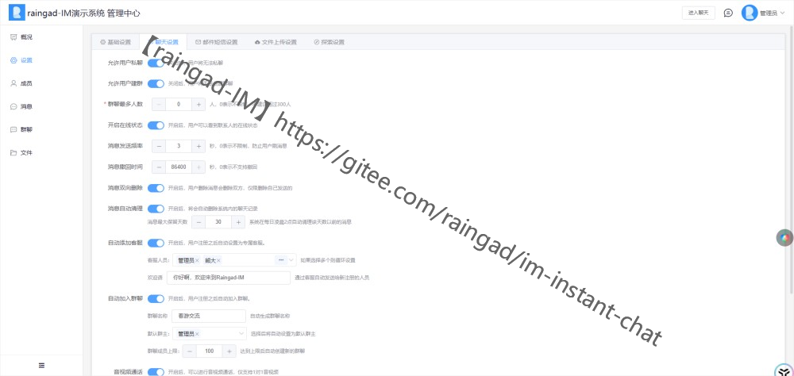

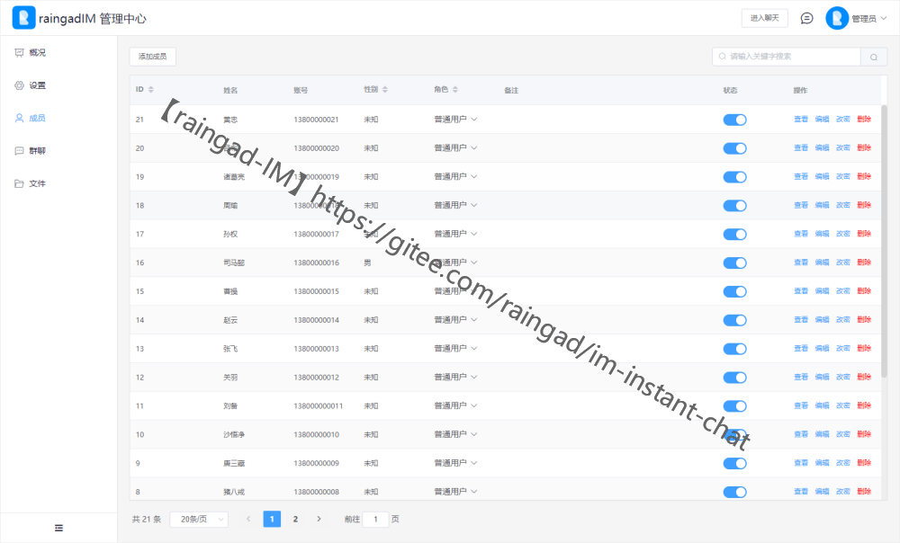

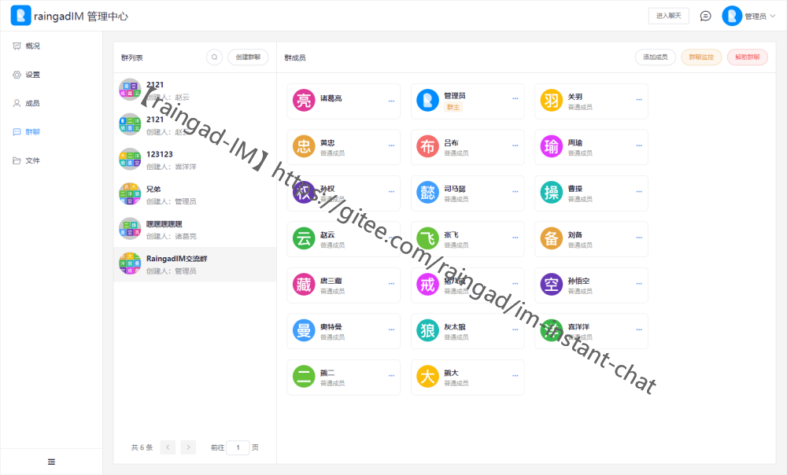

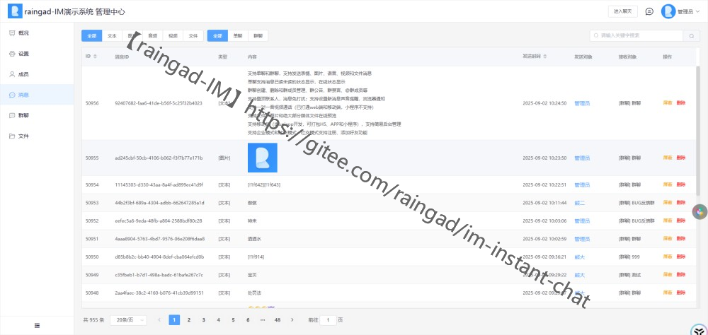

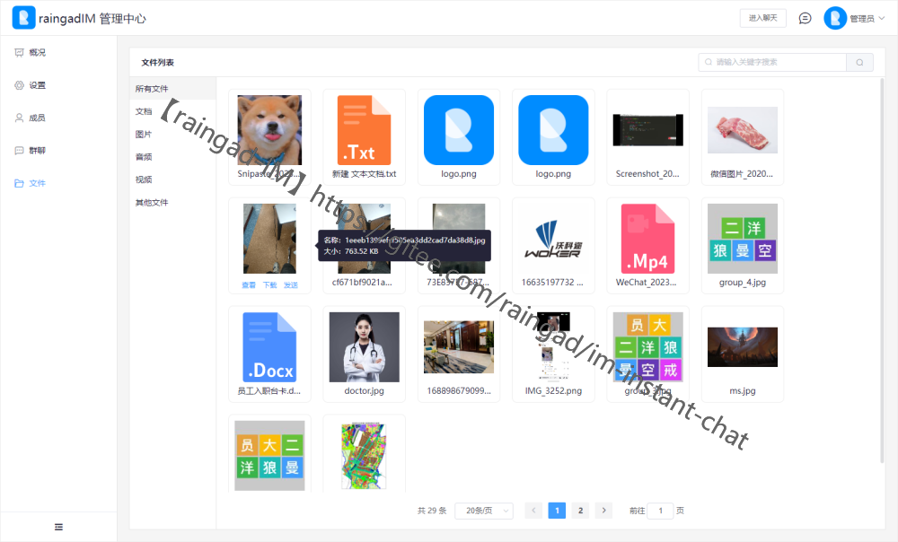

## 免责声明

### 1. 基本声明

本软件作为开源项目提供，在法律允许的最大范围内，开发者不对软件的功能性、安全性或适用性作出任何形式的保证，无论是明示的还是暗示的。

### 2. 使用风险声明

2.1 本软件按"现状"提供，使用者需自行承担使用本软件的全部风险。  
2.2 开发者不对软件的运行可靠性、适用性或与特定需求的兼容性提供任何保证。  
2.3 使用者应在充分评估风险的基础上决定是否使用本软件。

### 3. 责任限制与豁免

在任何情况下，开发者及其关联方均不对因使用或无法使用本软件而导致的任何损失或损害承担责任，包括但不限于：

- 数据丢失或泄露
- 利润损失
- 系统中断
- 商业机会损失
- 其他直接、间接或衍生性损失

### 4. 用户义务与责任

4.1 使用者应确保其对本软件的使用符合所有适用的法律法规要求。  
4.2 对本软件进行修改、分发或二次开发的使用者，需自行承担由此产生的全部责任，包括但不限于：

- 法律风险
- 知识产权风险
- 安全风险
- 数据保护责任

### 5. 开发者权利

5.1 开发者保留对本软件进行更新、修改、调整或停止维护的权利。  
5.2 开发者可能在不事先通知的情况下修改本软件或相关服务。  
5.3 开发者保留对本免责声明进行修改的权利。

### 6. 其他条款

6.1 本免责声明的任何部分被认定为无效或不可执行时，其余部分仍然有效。  
6.2 本免责声明的最终解释权归开发者所有。